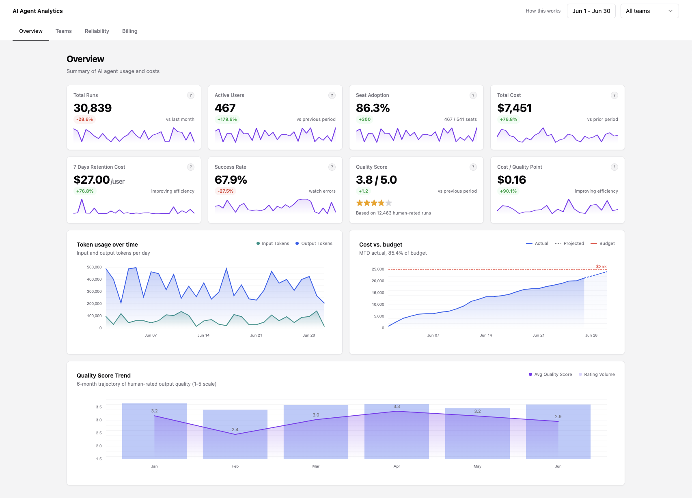

# AI Agent Analytics Dashboard

A single-page analytics dashboard for monitoring Claude Code usage across engineering teams. Built with React, TypeScript, Vite, and visx.

## What it does

The dashboard gives engineering leads and platform teams a single view of how Claude Code is being used across the organisation:

- **Executive Overview** - MAU trend, WoW growth, active-team count, and adoption rate KPIs at a glance.
- **Team Breakdown** - per-team usage table with trend sparklines, churn risk flagging, and week-over-week delta.
- **Reliability** - error-rate heatmap by team and week, p50/p95 latency trends, and a top-errors ranked list.
- **Billing** - cost breakdown by team, projected monthly spend, and a cost-per-active-user metric.
- **Understanding** - project scope, tech-stack reference, key KPI definitions, and architecture decisions documented inline.

All data is served from Mock Service Worker (MSW) - no backend required.



---

## Running the app

### Prerequisites

- Docker and Docker Compose installed on the host.
- Claude Code authenticated on the host (`~/.claude` and `~/.claude.json` must exist). Run `claude` once on the host to complete the browser login if you haven't already.

### Start

```bash
./scripts/up.sh
```

This builds the Docker image, starts the container, installs npm dependencies if needed, launches the Vite dev server on port 5173, and drops you into Claude Code running with `--dangerously-skip-permissions` inside the sandbox.

Open `http://localhost:5173` in your host browser.

### Stop

```bash
./scripts/down.sh
```

Stops and removes all containers.

### Open a shell in the running container

```bash
./scripts/ssh.sh
```

Attaches an interactive bash session to the already-running `claude-dev` container. The container must be running (started via `up.sh`) before calling this.

---

## Scripts reference

| Script              | What it does                                                                                                                |
| ------------------- | --------------------------------------------------------------------------------------------------------------------------- |
| `./scripts/up.sh`   | Build image, start container, install deps, start Vite dev server, launch Claude Code with `--dangerously-skip-permissions` |
| `./scripts/down.sh` | Stop and remove all containers                                                                                              |
| `./scripts/ssh.sh`  | Open a bash shell inside the running container                                                                              |

---

## npm scripts (run inside the container)

| Command                 | What it does                                         |
| ----------------------- | ---------------------------------------------------- |
| `npm run dev`           | Start Vite dev server on `0.0.0.0:5173`              |
| `npm run build`         | Type-check and produce a production build in `dist/` |
| `npm run preview`       | Serve the production build on port 4173              |
| `npm run test`          | Run the full Vitest suite once                       |
| `npm run test:watch`    | Run Vitest in watch mode                             |
| `npm run test:coverage` | Run tests with V8 coverage report                    |
| `npm run lint`          | ESLint over `src/`                                   |

---

## Tech stack

- **React 18** + **TypeScript** (strict mode)
- **Vite** - dev server and bundler
- **visx** - low-level SVG chart primitives (area, heatmap, axis, tooltip)
- **Preact Signals** (`@preact/signals-react`) - fine-grained reactive state for filters
- **TanStack Query** - server-state fetching and caching
- **MSW** - in-process API mocking, no backend needed
- **Tailwind CSS** + **shadcn/ui** components
- **React Router v6** - client-side routing
- **Vitest** + **Testing Library** - unit and integration tests

---

## Project structure

```
src/
  app/            - Router setup
  components/
    layout/       - DashboardLayout, nav, shell
    sections/     - Overview, TeamBreakdown, Reliability, Billing
    charts/       - Reusable visx chart wrappers
    filters/      - Date-range and team filter UI
    kpis/         - KPI card components
    ui/           - Primitive UI atoms (Button, Select, etc.)
  hooks/          - Shared React hooks
  lib/            - MSW handlers, filter signals, query clients
  routes/
    understanding/ - /understanding static page
  types/          - Shared TypeScript interfaces
  utils/          - Pure utility functions
docs/             - PRD, SPEC, TASKS, wireframes, investigation notes
scripts/          - Shell scripts for Docker workflow
```

---

## Docs

Detailed specs and task lists live in `docs/`. Key files:

- `docs/20260626-analytics-dashboard-plan.md` - overall workplan
- `docs/20260626-wp0N-*-spec.md` - per-workpackage technical specs
- `docs/20260626-wp0N-*-tasks.md` - per-workpackage task breakdowns
- `ARCHITECTURE.md` - invariants all code must follow
- `CLAUDE.md` - instructions for Claude Code when working in this repo
